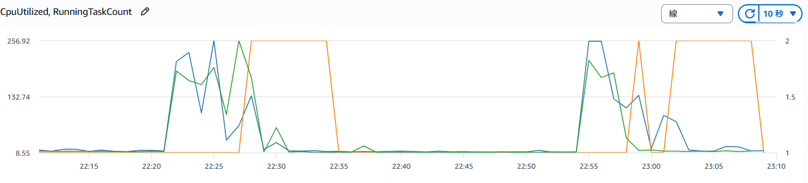
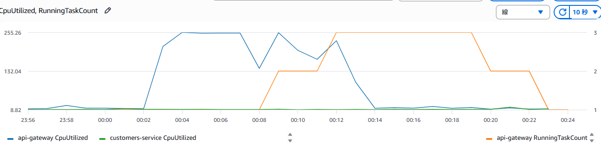
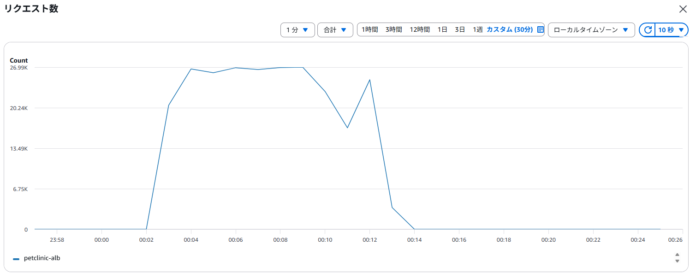

# Spring Petclinic on AWS ECS

## AWS CLI

Config

```sh
aws configure
aws configure get region
aws sts get-caller-identity
aws s3 ls
export AWS_ACCOUNT_ID=$(aws sts get-caller-identity --query Account --output text)
```

## Terraform

### [tfenv](https://github.com/tfutils/tfenv) 

```sh
git clone --depth=1 https://github.com/tfutils/tfenv.git ~/.tfenv
echo 'export PATH="$HOME/.tfenv/bin:$PATH"' >> ~/.bash_profile
tfenv --version
tfenv use latest
```

### Terraform Install

```sh
tfenv install
terraform --version
```

### Hello World

make main.tf

```sh
terraform init
terraform apply
terraform destroy
```

## config-server

config-server.tf
http://config-server:8888

```sh
aws ecs execute-command --cluster petclinic \
  --task $(aws ecs list-tasks --cluster petclinic --service-name config-server --query "taskArns[0]" --output text) \
  --container spring-petclinic-config-server  \
  --interactive --command "/usr/bin/curl http://api-gateway:8080"

```

configディレクトリにconfigファイルを配置し、gitリポジトリから参照させるように設定。
設定確認
spring.cloud.discovery.client.simple.instances が含まれていれば成功です。
```sh
aws ecs execute-command --cluster petclinic \
  --task $(aws ecs list-tasks --cluster petclinic --service-name config-server --query "taskArns[0]" --output text) \
  --container spring-petclinic-config-server \
  --interactive --command "/usr/bin/curl http://localhost:8888/api-gateway/docker"
```

## api-gateway

初期ホームの画面を持っているので起動する必要がある

api-gateway.tf
http://api-gateway:8080

config-serverへの接続テスト
```sh
aws ecs execute-command --cluster petclinic \
  --task $(aws ecs list-tasks --cluster petclinic --service-name api-gateway --query "taskArns[0]" --output text) \
  --container spring-petclinic-api-gateway  \
  --interactive --command "/usr/bin/curl http://config-server:8888"

```
※AWS Consoleから、サービスー＞タスクでコンテナへ辿り　Cloud Shellから接続でもできるが、コピペやカーソルキーでのコマンド履歴呼び出しがうまく効かないのでメインで使うのはやめた方がいい

```sh
aws ecs execute-command --cluster petclinic \
  --task $(aws ecs list-tasks --cluster petclinic --service-name api-gateway --query "taskArns[0]" --output text) \
  --container spring-petclinic-api-gateway  \
  --interactive --command "/bin/bash"

```


強制デプロイ
```sh
aws ecs update-service --cluster petclinic --service api-gateway --force-new-deployment
```

## customers-service

customers-service.tf
http://customers-service:8081

```sh
aws ecs execute-command --cluster petclinic \
  --task $(aws ecs list-tasks --cluster petclinic --service-name customers-service --query "taskArns[0]" --output text) \
  --container spring-petclinic-customers-service  \
  --interactive --command "/usr/bin/curl http://config-server:8888"

```

API gatewayからcustomersへの接続
```sh
aws ecs execute-command --cluster petclinic \
  --task $(aws ecs list-tasks --cluster petclinic --service-name api-gateway --query "taskArns[0]" --output text) \
  --container spring-petclinic-api-gateway  \
  --interactive --command "/usr/bin/curl http://customers-service:8081/owners"

```

Bash
```sh
aws ecs execute-command --cluster petclinic \
  --task $(aws ecs list-tasks --cluster petclinic --service-name customers-service --query "taskArns[0]" --output text) \
  --container spring-petclinic-customers-service  \
  --interactive --command "/bin/bash"
```

Logs
```sh
aws logs get-log-events \
  --log-group-name /ecs/spring-petclinic-customers-service \
  --log-stream-name $(aws logs describe-log-streams \
    --log-group-name /ecs/spring-petclinic-customers-service \
    --order-by LastEventTime --descending \
    --query "logStreams[0].logStreamName" --output text) \
  --query "events[*].message"
```

```sh
aws ecs execute-command --cluster petclinic \
  --task $(aws ecs list-tasks --cluster petclinic --service-name customers-service --query "taskArns[0]" --output text) \
  --container spring-petclinic-customers-service  \
  --interactive --command "/usr/bin/curl -s localhost:8081/actuator/health"

curl -s localhost:8081/actuator/health | python3 -m json.tool

curl http://localhost:8081/owners
```

強制デプロイ
```sh
aws ecs update-service --cluster petclinic --service customers-service --force-new-deployment
```

## Mysql化

Aurora Serverless v2を使ってみる

使えるバージョン

```sh
aws rds describe-db-engine-versions \
  --engine aurora-mysql \
  --query "DBEngineVersions[*].EngineVersion" \
  --output text | tr '\t' '\n' | grep "^8.0"
8.0.mysql_aurora.3.04.0
8.0.mysql_aurora.3.04.1
8.0.mysql_aurora.3.04.2
8.0.mysql_aurora.3.04.3
8.0.mysql_aurora.3.04.4
8.0.mysql_aurora.3.04.6
8.0.mysql_aurora.3.08.0
8.0.mysql_aurora.3.08.1
8.0.mysql_aurora.3.08.2
8.0.mysql_aurora.3.09.0
8.0.mysql_aurora.3.10.0
8.0.mysql_aurora.3.10.1
8.0.mysql_aurora.3.10.2
8.0.mysql_aurora.3.10.3
8.0.mysql_aurora.3.11.1
8.0.mysql_aurora.3.12.0
```

cloud shellから確認
```sh
mysql -h petclinic.cluster-c5lp7tfbe9g1.ap-northeast-1.rds.amazonaws.com -P 3306 --ssl-ca /certs/global-bundle.pem --ssl-verify-server-cert -u petclinic -p
```
画面でデータを入れてから以下で確認
```sql
use petclinic;
select * from owners;
```

## vets

vets-service.tf
http://vets-service:8083

API gatewayからvetsへの接続
```sh
aws ecs execute-command --cluster petclinic \
  --task $(aws ecs list-tasks --cluster petclinic --service-name api-gateway --query "taskArns[0]" --output text) \
  --container spring-petclinic-api-gateway  \
  --interactive --command "/usr/bin/curl http://vets-service:8083/vets"

```


## visits

visits-service.tf
http://visits-service:8082

API gatewayからvisitsへの接続
```sh
aws ecs execute-command --cluster petclinic \
  --task $(aws ecs list-tasks --cluster petclinic --service-name api-gateway --query "taskArns[0]" --output text) \
  --container spring-petclinic-api-gateway  \
  --interactive --command "/usr/bin/curl http://visits-service:8082/visits"

```


## Tracing Server

otel.tf
X-Rayで表示する

OTEL Collectorが動作しているか確認
```sh
aws logs get-log-events \
  --log-group-name /ecs/aws-otel-collector \
  --log-stream-name $(aws logs describe-log-streams \
    --log-group-name /ecs/aws-otel-collector \
    --order-by LastEventTime --descending \
    --query "logStreams[0].logStreamName" --output text) \
  --query "events[*].message" --output text
```

トレース表示
```sh
$ aws xray get-trace-summaries   --start-time $(date -d '5 minutes ago' +%s)   --end-time $(date +%s)   --query "TraceSummaries[*].{Id:Id,Service:EntryPoint.Name}"   --output table
```

petclinicはzipkin形式で出力しているのでそれをOTEL Collectorが読めるようにしてあげる必要があった。

CloudWatch → (APM内)トレースマップ

## Auto Scale out api-gateway

### CPU/memoryベース

autoscaling.tf
ECS → サービス → 自動スケーリング

Public IP
```sh
API_GW_PUBLIC_IP=$( \
aws ec2 describe-network-interfaces \
  --network-interface-ids $(aws ecs describe-tasks --cluster petclinic \
    --tasks $(aws ecs list-tasks --cluster petclinic --service-name api-gateway --query "taskArns[0]" --output text) \
  --query 'tasks[0].attachments[0].details[?name==`networkInterfaceId`].value' \
  --output text) \
  --query 'NetworkInterfaces[0].Association.PublicIp' --output text \
)

```

Hey
```sh
sudo apt install hey
```

```sh
hey -n 10000 -c 100 -m GET http://${API_GW_PUBLIC_IP}:8080/api/customer/owners
```

CloudWatch → メトリクス → ECS → ClusterName, ServiceName → DesiredTaskCount / RunningTaskCount

※Public IPはタスクごとに振られるので、最初のIPだけに負荷をかけても期待の状態にならない
ので、やはりALBを立てる

alb.tf

ALBへの接続確認
```sh
curl http://$(terraform output -raw alb_dns_name)
```

ALBへのhey
```sh
hey -z 3m -c 60 -m GET http://$(terraform output -raw alb_dns_name)/api/customer/owners
hey -z 5m -c 100 -m GET http://$(terraform output -raw alb_dns_name)/
hey -z 10m -c 120 -m GET http://$(terraform output -raw alb_dns_name)/

```

-c 120
```
Summary:
  Total:        600.2993 secs
  Slowest:      6.0865 secs
  Fastest:      0.0063 secs
  Average:      0.2890 secs
  Requests/sec: 415.1512
  
  Total data:   896426355 bytes
  Size/request: 3597 bytes

Response time histogram:
  0.006 [1]     |
  0.614 [235255]        |■■■■■■■■■■■■■■■■■■■■■■■■■■■■■■■■■■■■■■■■
  1.222 [11859] |■■
  1.830 [1520]  |
  2.438 [357]   |
  3.046 [127]   |
  3.654 [92]    |
  4.262 [3]     |
  4.870 [0]     |
  5.479 [0]     |
  6.087 [1]     |


Latency distribution:
  10% in 0.0910 secs
  25% in 0.1904 secs
  50% in 0.2211 secs
  75% in 0.3863 secs
  90% in 0.5029 secs
  95% in 0.6851 secs
  99% in 1.1756 secs

Details (average, fastest, slowest):
  DNS+dialup:   0.0000 secs, 0.0063 secs, 6.0865 secs
  DNS-lookup:   0.0000 secs, 0.0000 secs, 0.1877 secs
  req write:    0.0000 secs, 0.0000 secs, 0.0031 secs
  resp wait:    0.2871 secs, 0.0062 secs, 6.0863 secs
  resp read:    0.0018 secs, 0.0000 secs, 0.5463 secs

Status code distribution:
  [200] 249215 responses
```




### リクエスト数ベース（ALB使用）


項目	変更前（CPU）	変更後（リクエスト数）
ポリシータイプ	StepScaling	TargetTracking
メトリクス	CPUUtilization	ALBRequestCountPerTarget
閾値	CPU 70%	タスクあたり100 req/分
CloudWatchアラーム	手動設定が必要	自動作成される


```sh
# 約150 req/分 = 2.5 req/sec × 60
hey -z 10m -c 5 -m GET http://$(terraform output -raw alb_dns_name)/
```


## 強制終了後の復帰確認

```
# タスクARNを取得して停止
aws ecs stop-task --cluster petclinic \
  --task $(aws ecs list-tasks --cluster petclinic --service-name api-gateway \
    --query 'taskArns[0]' --output text)
```

# ここから下は古い！！

## api-gateway


## Cluster

```sh
aws ecs create-cluster --cluster-name petclinic --tag key=project,value=petclinic --capacity-providers FARGATE
# aws ecs delete-cluster --cluster petclinic
```

## Service Discovery(Cloud Map)

```sh
aws servicediscovery create-private-dns-namespace \
    --name petclinic.local \
    --vpc vpc-2636c543
```

## config-server

### Push Image

```sh
# 東京リージョンに “my-app” という名前のリポジトリを作成する例
aws ecr create-repository \
    --repository-name springcommunity/spring-petclinic-config-server \
    --region ap-northeast-1 \
    --tags Key=project,Value=petclinic

aws ecr get-login-password --region ap-northeast-1 | docker login --username AWS --password-stdin ${AWS_ACCOUNT_ID}.dkr.ecr.ap-northeast-1.amazonaws.com
docker build -t spring-petclinic/config-server .

docker tag springcommunity/spring-petclinic-config-server:latest ${AWS_ACCOUNT_ID}.dkr.ecr.ap-northeast-1.amazonaws.com/springcommunity/spring-petclinic-config-server:latest

docker push ${AWS_ACCOUNT_ID}.dkr.ecr.ap-northeast-1.amazonaws.com/springcommunity/spring-petclinic-config-server:latest

```

### Create Task Definition

```sh
aws ecs register-task-definition --cli-input-yaml file://config-server-task-definition.yaml
```

```sh
aws ecs register-task-definition \
    --family spring-petclinic-config-server \
    --network-mode awsvpc \
    --requires-compatibilities FARGATE \
    --cpu "256" \
    --memory "512" \
    --execution-role-arn "arn:aws:iam::${AWS_ACCOUNT_ID}:role/ecsTaskExecutionRole" \
    --container-definitions '[
        {
            "name": "spring-petclinic-config-server",
            "image": "springcommunity/spring-petclinic-config-server:latest",
            "essential": true,
            "portMappings": [
                {
                    "containerPort": 8888,
                    "protocol": "tcp"
                }
            ],
            "logConfiguration": {
                "logDriver": "awslogs",
                "options": {
                    "awslogs-group": "/ecs/spring-petclinic-config-server",
                    "awslogs-region": "ap-northeast-1",
                    "awslogs-stream-prefix": "ecs"
                }
            }
        }
    ]'
 
```

#### Terraform

既存リソースのインポート
```
terraform import aws_ecs_cluster.main petclinic
terraform apply
```

削除
```
terraform destroy
```

タスクのパブリックIP取得
```sh
TASK_ARN=$(aws ecs list-tasks --cluster nginx-test --service-name nginx --query 'taskArns[0]' --output text)

ENI_ID=$(aws ecs describe-tasks --cluster nginx-test --tasks $TASK_ARN \
  --query 'tasks[0].attachments[0].details[?name==`networkInterfaceId`].value' \
  --output text)

aws ec2 describe-network-interfaces \
  --network-interface-ids $ENI_ID \
  --query 'NetworkInterfaces[0].Association.PublicIp' \
  --output text
```


## discovery-server

ECS でのサービス間通信には AWS Cloud Map（ECS Service Discovery）を使います

petclinic.tfにサービスディスカバリの設定を追加する


## Grafana, Prometeus

今回はCloudWatch
tfにCloudWatch Conteiner Insightsの設定を追加する

ほかの選択としてはAMG,AMPがある
Amazon Maneged Service for Prometheus(AMP)
Amazon Managed Grafana(AMG)

ECSで起動する手もあるが、動的IPへの追随が難しい

## API Gateway

ALBを使うことにする（Claude曰く、API GatewayはVPCリンクが必要になる）
alb.tf

フロントエンドUIの部分は、とりあえずECSでそのまま動かす
api-gateway.tf

いじった点
- config-serverのサービス名変更
- eurekaの無効化

うまく行かない時は強制デプロイも試す
```sh
aws ecs update-service --cluster petclinic --service api-gateway --force-new-deployment
```

ALBのDNS名でブラウザからアクセス

terraform output alb_dns_name

## customers,vets,visits


## Tracing Server

サービスが動き出してからにする
後回し


k apply -f customers-service.yaml -n petclinic
k apply -f vets-service.yaml -n petclinic
k apply -f visits-service.yaml -n petclinic


